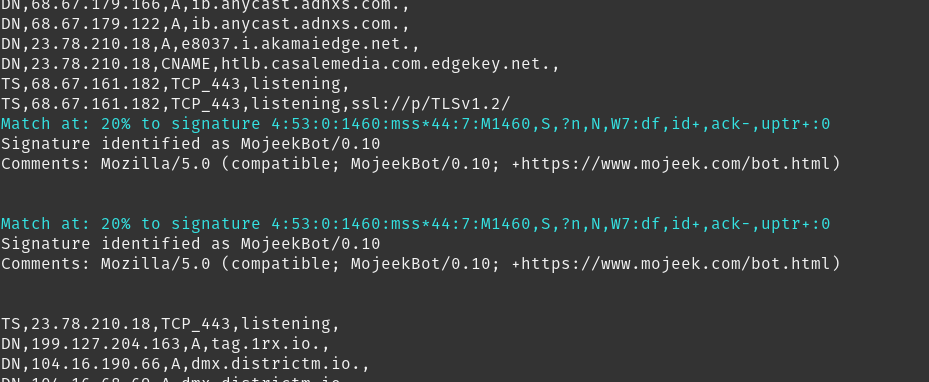

<div id="top"></div>


<!-- PROJECT SHIELDS -->
[![Contributors][contributors-shield]][contributors-url]
[![Forks][forks-shield]][forks-url]
[![Stargazers][stars-shield]][stars-url]
[![Issues][issues-shield]][issues-url]
[![MIT License][license-shield]][license-url]


<!-- PROJECT LOGO -->
<br />
<div align="center">
  <a href="https://github.com/activecm/passer">
    
  </a>

<h3 align="center">Smudge</h3>

  <p align="center">
    project_description
    <br />
    <a href="https://github.com/activecm/passer"><strong>Explore the docs »</strong></a>
    <br />
    <br />
    <a href="https://github.com/activecm/passer">View Demo</a>
    ·
    <a href="https://github.com/activecm/passer/issues">Report Bug</a>
    ·
    <a href="https://github.com/activecm/passer/issues">Request Feature</a>
  </p>
</div>


<!-- TABLE OF CONTENTS -->
<details>
  <summary>Table of Contents</summary>
  <ol>
    <li>
      <a href="#about-the-project">About The Project</a>
      <ul>
        <li><a href="#built-with">Built With</a></li>
      </ul>
    </li>
    <li>
      <a href="#getting-started">Getting Started</a>
      <ul>
        <li><a href="#prerequisites">Prerequisites</a></li>
        <li><a href="#installation">Installation</a></li>
      </ul>
    </li>
    <li><a href="#usage">Usage</a></li>
    <li><a href="#signatures">Signatures</a></li>
    <li><a href="#contributing">Contributing</a></li>
    <li><a href="#license">License</a></li>
    <li><a href="#contact">Contact</a></li>
    <li><a href="#logo">Logo</a></li>
    <li><a href="#acknowledgments">Acknowledgments</a></li>
  </ol>
</details>


<!-- ABOUT THE PROJECT -->
## About The Project

<a href="https://github.com/activecm/passer">
    
</a>


<p align="right">(<a href="#top">back to top</a>)</p>


### Built With

* [Python](https://www.python.org/)
* [Scapy](https://scapy.net/)


<p align="right">(<a href="#top">back to top</a>)</p>


### Prerequisites

This is an example of how to list things you need to use the software and how to install them.
* npm
  ```sh
  npm install npm@latest -g
  ```


<p align="right">(<a href="#top">back to top</a>)</p>


<!-- USAGE EXAMPLES -->
## Usage

Smudge is a component of Active Countermeasure's Passer. It can be called from the command line via the following arguments:

<a> `-p, --passive_fingerprinting`<br/>Enables Smudge.</a><br/>
<a> `-d, --devel`<br/>Creates signatures and outputs them. </a><br/>
<a> `-j, --json`<br/>Specifies local file to load signatures from. </a><br/>

_For more examples, please refer to the [Documentation](https://example.com)_

<p align="right">(<a href="#top">back to top</a>)</p>


<!-- Signatures -->
## Create Your Own Signatures

This repository includes a tool called "sig_gen.py". This tool can be leveraged to create signatures from known sources. Signatures are created in the same format as p0f and information about the signature format can be found here [p0f](https://github.com/p0f/p0f).

Signatures are stored in a Github Repository maintained by Active COuntermeasures that can be found here [tcp-sig-json](https://github.com/activecm/tcp-sig-json).
Adding a new signature is as easy creating a new pull request.


<p align="right">(<a href="#top">back to top</a>)</p>


<!-- CONTRIBUTING -->
## Contributing

Contributions are what make the open source community such an amazing place to learn, inspire, and create. Any contributions you make are **greatly appreciated**.

If you have a suggestion that would make this better, please fork the repo and create a pull request. You can also simply open an issue with the tag "enhancement".
Don't forget to give the project a star! Thanks again!

1. Fork the Project
2. Create your Feature Branch (`git checkout -b feature/AmazingFeature`)
3. Commit your Changes (`git commit -m 'Add some AmazingFeature'`)
4. Push to the Branch (`git push origin feature/AmazingFeature`)
5. Open a Pull Request

<p align="right">(<a href="#top">back to top</a>)</p>


<!-- LICENSE -->
## License

Distributed under the MIT License. See `LICENSE.txt` for more information.

<p align="right">(<a href="#top">back to top</a>)</p>


<!-- CONTACT -->
## Contact

David Quartarolo - [@d_quartarolo](https://twitter.com/d_quartarolo) - david@activecountermeasures.com

Project Link: [https://github.com/activecm/passer](https://github.com/activecm/passer)

<p align="right">(<a href="#top">back to top</a>)</p>


<!-- ACKNOWLEDGMENTS -->
## Acknowledgments

* [Bill Stearns](https://github.com/william-stearns)
  Bill has been working with me on this from day 1. Checkout Bill's Site [here](http://www.stearns.org/)


<p align="right">(<a href="#top">back to top</a>)</p>


<!-- MARKDOWN LINKS & IMAGES -->
<!-- https://www.markdownguide.org/basic-syntax/#reference-style-links -->
[contributors-shield]: https://img.shields.io/github/contributors/activecm/passer
[contributors-url]: https://github.com/github_username/repo_name/graphs/contributors
[forks-shield]: https://img.shields.io/github/forks/activecm/passer
[forks-url]: https://github.com/github_username/repo_name/network/members
[stars-shield]: https://img.shields.io/github/stars/activecm/passer
[stars-url]: https://github.com/activecm/passer/stargazers
[issues-shield]: https://img.shields.io/github/issues/activecm/passer
[issues-url]: https://github.com/github_username/repo_name/issues
[license-shield]: https://img.shields.io/github/license/activecm/passer
[license-url]: https://github.com/github_username/repo_name/blob/master/LICENSE.txt
[product-screenshot]: images/screenshot.png